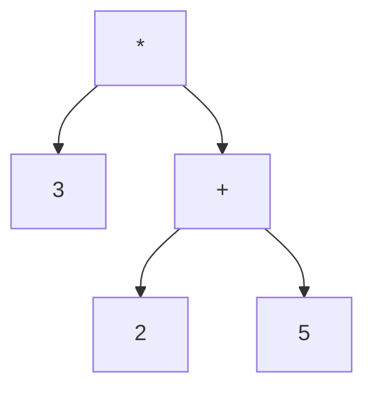
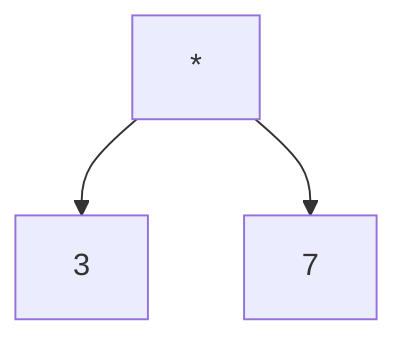
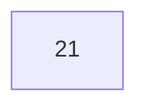
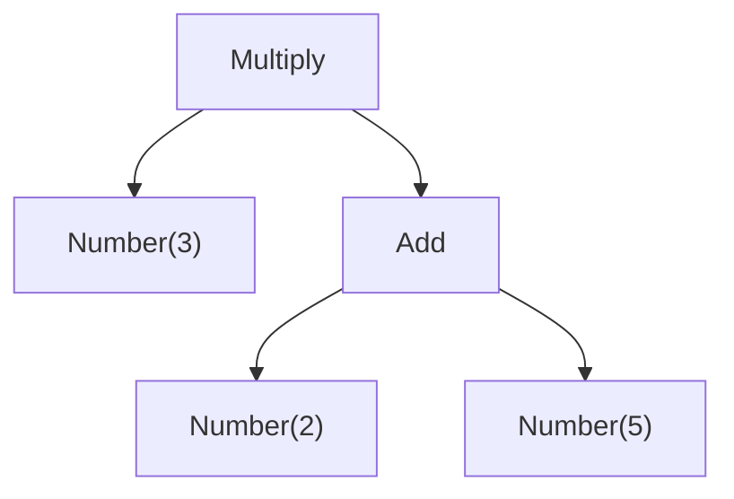

# Part 1: Evaluating

## Context

Usually, programming languages are compiled or interpreted by first turning the
source code (a `String`) into a list of tokens (which we'll do in [part 2](./2-tokenization.md)).
The parser then turns that list of tokens into an
[abstract syntax tree](https://en.wikipedia.org/wiki/Abstract_syntax_tree), or AST for short.
We'll do that in [part 3](./3-parsing.md). We can then either evaluate our AST directly, or
compile it (turn it into machine code).

We can do the same thing for mathematical expressions: first we tokenize the input, then we parse it,
and finally we can evaluate it. This is what our calculator will do.

For part 1, we'll assume that the task of tokenization and parsing is already done, and all we need
to do is evaluate our AST, and result the result of the calculation (or an error).

We can represent any mathematical expression as an abstract syntax tree. For example, the expression
`3 * (2 + 5)` (which should evaluate to `21`), can be represented by the following tree:



We can then evaluate it in two steps. We can first evaluate the `+`:



And then when we evaluate the `*`, we get `21`:



[`src/expression.gleam`](../src/expression.gleam) contains an `Expression` type, which represents this sort of tree in a 
very similar way:



In Gleam source code, this would be written as:

```gleam
Multiply(Number(3), Add(Number(2), Number(5)))
```

## Implementation

The objective of part 1 is to implement the `evaluate` function
in [`src/evaluate.gleam`](../src/evaluate.gleam).

It should return `Ok` with the result of the calculation, or `Error(DivideByZeroError)`.

The error types are defined in [`src/error.gleam`](../src/error.gleam).

Examples:

- `evaluate(Number(42))` returns `Ok(42)`
- `evaluate(Negation(Number(10)))` returns `Ok(-10)`
- `evaluate(Multiply(Number(4), Number(2)))` returns `Ok(8)`
- `evaluate(Divide(Number(3), Number(2)))` returns `Ok(2)`
- `evaluate(Divide(Negation(5), Number(2)))` returns `Ok(-3)`
- `evaluate(Divide(Number(2), Number(0)))` returns `Error(DivideByZeroError)`

You may find the `operands` function, defined in [`src/expression.gleam`](../src/expression.gleam) useful.

## Testing

The tests are defined in [`test/evaluate_test.gleam`](../test/evaluate_test.gleam). To only run
these tests, run:

```sh
gleam test evaluate_test
```

To run all tests, run:

```sh
gleam test
```